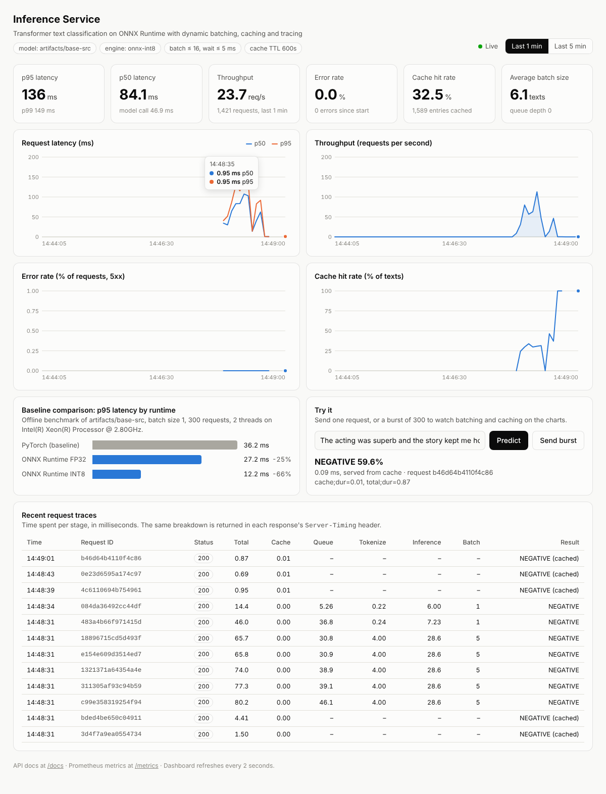
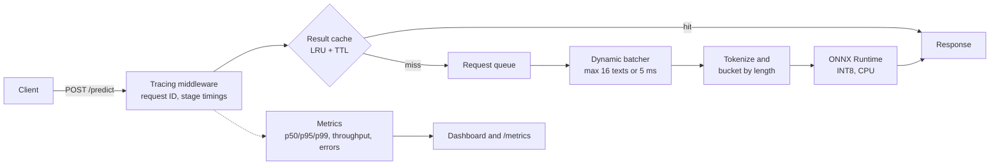

# Model Inference Service with ONNX Runtime Optimization

A production-style inference service for Hugging Face Transformer models on CPU.
A trained PyTorch model is exported to ONNX, quantized to INT8 and served with
ONNX Runtime behind FastAPI, with dynamic request batching, result caching,
per-request tracing and a live metrics dashboard that compares the service
against its PyTorch baseline.

**Python · PyTorch · Hugging Face · ONNX Runtime · FastAPI · Docker**



## What it does

| Area | Implementation |
|---|---|
| ONNX export | `scripts/export_onnx.py` exports any Hugging Face sequence-classification model with dynamic batch and sequence axes, applies dynamic INT8 quantization, and rejects the export if the FP32 logits drift from PyTorch by more than 1e-3. |
| Baseline benchmark | `scripts/benchmark.py` runs PyTorch, ONNX FP32 and ONNX INT8 over the same inputs and tokenizer, and reports p50/p95/p99 latency and throughput. |
| Request batching | `app/batching.py` collects concurrent requests into one model call (up to 16 texts or 5 ms), then groups them by token length so short texts are not padded to the longest one. |
| Result caching | `app/cache.py` is an LRU cache with TTL, keyed on model identity and input text. |
| Tracing | Every request gets an ID and per-stage timings (cache, queue, tokenize, inference), returned in the `X-Request-ID` and `Server-Timing` headers, logged as one JSON line and listed at `/traces`. |
| Metrics | `app/metrics.py` tracks latency percentiles, throughput, error rate, cache hit rate and batch size over a rolling window, exposed as JSON for the dashboard and in Prometheus format at `/metrics`. |
| Serving image | Multi-stage Dockerfile: PyTorch is used only in the build stage to export the model. The final image runs on ONNX Runtime and `tokenizers` alone. |

## Architecture



## Results

Measured on a 2-vCPU cloud container (Intel Xeon 2.80 GHz), 2 threads, with a
DistilBERT-base architecture (6 layers, 66M parameters) and mixed-length inputs
of 4 to 60 tokens.

> These numbers were taken with randomly initialised weights, because the
> machine they were measured on could not reach the Hugging Face Hub. Latency
> depends on the architecture and input length, not on the weight values, but
> you should rerun `make benchmark` on your own hardware with the real model
> and replace this section with your own numbers.

**Model runtime, one request at a time** (`python -m scripts.benchmark`, 300 requests per row)

| Engine | Batch | p50 (ms) | p95 (ms) | p99 (ms) | Throughput (texts/s) | p95 vs PyTorch |
|---|---:|---:|---:|---:|---:|---:|
| PyTorch | 1 | 28.33 | 36.23 | 41.01 | 35.4 | baseline |
| ONNX Runtime FP32 | 1 | 14.60 | 27.23 | 32.24 | 62.0 | -24.9% |
| ONNX Runtime INT8 | 1 | 5.88 | 12.17 | 15.43 | 148.9 | -66.4% |
| PyTorch | 8 | 117.90 | 177.92 | 196.35 | 65.1 | baseline |
| ONNX Runtime FP32 | 8 | 84.04 | 154.30 | 168.77 | 83.2 | -13.3% |
| ONNX Runtime INT8 | 8 | 36.79 | 67.99 | 76.36 | 196.4 | -61.8% |

Model file size: 267.8 MB (PyTorch) and 267.7 MB (ONNX FP32) down to 67.2 MB (ONNX INT8).

**Whole service under load** (`python -m scripts.load_test`, 1,500 requests, 32 concurrent clients, load generator on the same 2 vCPUs)

| Configuration | Throughput (req/s) | p95 (ms) | Error rate |
|---|---:|---:|---:|
| PyTorch, no batching, no cache | 23.8 | 1,524 | 0% |
| ONNX INT8, no batching, no cache | 93.9 | 381 | 0% |
| ONNX INT8 + dynamic batching | 122.0 | 316 | 0% |
| ONNX INT8 + batching + cache (30% repeated inputs) | 152.6 | 333 | 0% |

With 32 clients on 2 cores the latency here is mostly queueing time, so read
this table for the relative differences between configurations.

### What I learned from the measurements

- **Quantization is where most of the CPU gain comes from.** Converting to ONNX
  FP32 cut p95 by about 25%; INT8 cut it by about 66%.
- **Naive batching made things slower.** Padding every text in a batch to the
  longest one meant a batch of 16 mixed-length texts ran at 143 texts/s, no
  better than one at a time (137 to 173 texts/s). Grouping each batch by token
  length before padding raised that to 250 texts/s, which is why the engine
  buckets by length.
- **Quantization changes the outputs slightly.** On the export check the INT8
  logits differ from PyTorch by up to 1e-2, against 4e-7 for FP32. Check
  `artifacts/model/export_report.json` for your model, and evaluate accuracy on
  a labelled set before relying on the INT8 model.

## Quickstart

Requires Python 3.10 or newer.

```bash
git clone https://github.com/swayam16/Model-Inference-Service-with-ONNX-Runtime-Optimization.git
cd Model-Inference-Service-with-ONNX-Runtime-Optimization
python -m venv .venv && source .venv/bin/activate    # Windows: .venv\Scripts\activate
pip install -r requirements-dev.txt

make model        # download the model and export it to ONNX (FP32 + INT8)
make benchmark    # PyTorch vs ONNX Runtime on your machine
make serve        # API and dashboard on http://localhost:8000
```

Then, in a second terminal:

```bash
curl -s -X POST http://localhost:8000/predict \
  -H "Content-Type: application/json" \
  -d '{"text": "The acting was superb and the story kept me hooked."}'

make load         # 1,500 requests at concurrency 32; watch the dashboard move
```

Without `make`, run the commands inside the `Makefile` directly, for example
`python -m scripts.export_onnx` and `uvicorn app.main:app --port 8000`.

The default model is
[`distilbert-base-uncased-finetuned-sst-2-english`](https://huggingface.co/distilbert-base-uncased-finetuned-sst-2-english)
(sentiment). To serve a different classifier:

```bash
python -m scripts.export_onnx --model <hub-id-or-local-path>
```

### Docker

```bash
docker compose up --build      # http://localhost:8000
```

The build stage downloads the model, exports it and runs the benchmark, so the
first build takes a few minutes.

## API

| Method | Path | Purpose |
|---|---|---|
| POST | `/predict` | Classify one text: `{"text": "..."}` |
| POST | `/predict/batch` | Classify up to 64 texts: `{"texts": ["...", "..."]}` |
| GET | `/` | Live dashboard |
| GET | `/metrics/summary` | Latency percentiles, throughput, error rate, cache and batch stats (JSON) |
| GET | `/metrics` | Prometheus exposition format |
| GET | `/traces` | Most recent request traces |
| GET | `/benchmark` | The recorded PyTorch-vs-ONNX benchmark |
| GET | `/info` | Model, engine and configuration |
| GET | `/healthz`, `/readyz` | Liveness and readiness probes |
| GET | `/docs` | Interactive OpenAPI docs |

Example response, with the trace in the headers:

```
HTTP/1.1 200 OK
x-request-id: 55e00c58d04849ce
server-timing: cache;dur=0.00, queue;dur=5.25, tokenize;dur=0.23, inference;dur=5.05, total;dur=14.14

{"label": "POSITIVE", "score": 0.9998, "scores": {"NEGATIVE": 0.0002, "POSITIVE": 0.9998},
 "cached": false, "request_id": "55e00c58d04849ce", "model": "distilbert-base-uncased-finetuned-sst-2-english",
 "engine": "onnx-int8", "latency_ms": 13.3}
```

Overload returns `503` with `Retry-After` once the queue is full, and a request
that waits longer than the timeout returns `504`.

## Configuration

All settings are environment variables.

| Variable | Default | Meaning |
|---|---|---|
| `ENGINE` | `onnx` | `onnx`, or `pytorch` to serve the baseline (needs the dev requirements) |
| `MODEL_DIR` | `artifacts/model` | Directory written by the export script |
| `ONNX_FILE` | `model.quant.onnx` | Use `model.onnx` for the FP32 graph |
| `MAX_SEQ_LEN` | `128` | Inputs are truncated to this many tokens |
| `INTRA_OP_THREADS` | `0` | Threads per model call; 0 lets the runtime decide |
| `BATCHING_ENABLED` | `true` | Turn dynamic batching on or off |
| `MAX_BATCH_SIZE` | `16` | Largest batch sent to the model |
| `MAX_BATCH_WAIT_MS` | `5` | Longest a request waits for others to join its batch |
| `MAX_QUEUE_SIZE` | `512` | Requests beyond this are rejected with 503 |
| `REQUEST_TIMEOUT_S` | `10` | Per-request inference timeout |
| `CACHE_ENABLED` | `true` | Turn the result cache on or off |
| `CACHE_MAX_ITEMS` | `10000` | Cache capacity (least recently used entries are evicted) |
| `CACHE_TTL_S` | `600` | Cache entry lifetime in seconds |
| `METRICS_WINDOW_S` | `300` | How much history the dashboard charts keep |

To reproduce the load-test table, start the service with different settings:

```bash
ENGINE=pytorch BATCHING_ENABLED=false CACHE_ENABLED=false make serve   # baseline
BATCHING_ENABLED=false CACHE_ENABLED=false make serve                  # ONNX only
CACHE_ENABLED=false make serve                                         # ONNX + batching
make serve                                                             # everything on
```

## Deploy it live (free, on Hugging Face Spaces)

The repo deploys as a Docker Space on the free CPU tier (2 vCPU, 16 GB RAM).
Free Spaces go to sleep when unused and wake on the next visit.

1. Create a free account at [huggingface.co](https://huggingface.co/join).
2. Go to [huggingface.co/new-space](https://huggingface.co/new-space). Name it
   `onnx-inference-service`, choose **Docker** as the SDK with the **Blank**
   template, keep the free hardware, and create the Space.
3. Create an access token with **write** permission at
   [huggingface.co/settings/tokens](https://huggingface.co/settings/tokens).
4. In your GitHub repo, open **Settings → Secrets and variables → Actions** and add:
   - under **Secrets**: `HF_TOKEN` = the token from step 3
   - under **Variables**: `HF_SPACE` = `<your-hf-username>/onnx-inference-service`
5. Push to `main` (or run the **Deploy to Hugging Face Spaces** workflow from
   the Actions tab). The workflow pushes the code to the Space, which builds
   the Docker image and starts it.

Your service is then live at
`https://<your-hf-username>-onnx-inference-service.hf.space`. The first build
takes several minutes; follow it in the Space's **Logs** tab.

The image listens on `$PORT` (default 7860), so it also runs unchanged on any
host that builds a Dockerfile.

## Project structure

```
app/
  main.py          FastAPI app: endpoints, tracing middleware, wiring
  engines.py       ONNX Runtime and PyTorch engines, tokenizer, length bucketing
  batching.py      Dynamic request batcher
  cache.py         LRU + TTL result cache
  metrics.py       Rolling-window metrics and Prometheus output
  tracing.py       Request IDs, stage timings, trace buffer
  config.py        Environment-variable settings
  static/          Dashboard (single HTML file, no build step)
scripts/
  export_onnx.py   Export, quantize and validate against PyTorch
  benchmark.py     PyTorch vs ONNX FP32 vs ONNX INT8
  load_test.py     Concurrent load generator for a running service
  make_test_model.py  Random-weight model for tests and offline benchmarking
tests/             39 tests: cache, metrics, batching, API, export end to end
Dockerfile         Multi-stage build; the serving image has no PyTorch
.github/workflows/ CI (lint + tests) and deploy to Hugging Face Spaces
```

## Tests

```bash
make test    # 39 tests, about 10 seconds, no network needed
make lint
```

The suite builds a tiny random model, exports it and serves it, so the export
and ONNX Runtime paths are covered without downloading anything.

## Limitations and next steps

- The cache and metrics live in process memory, so run one worker per
  container. Scaling out would need Redis for the cache and Prometheus scraping
  each replica.
- Identical texts that arrive at the same moment are each sent to the model;
  only later repeats hit the cache.
- Accuracy of the INT8 model is checked by label agreement on a small sample.
  Evaluating on a labelled validation set (for example SST-2) would quantify
  the trade-off properly.
- Tracing is in-process. Exporting spans with OpenTelemetry would connect it
  to other services.

## License

MIT
